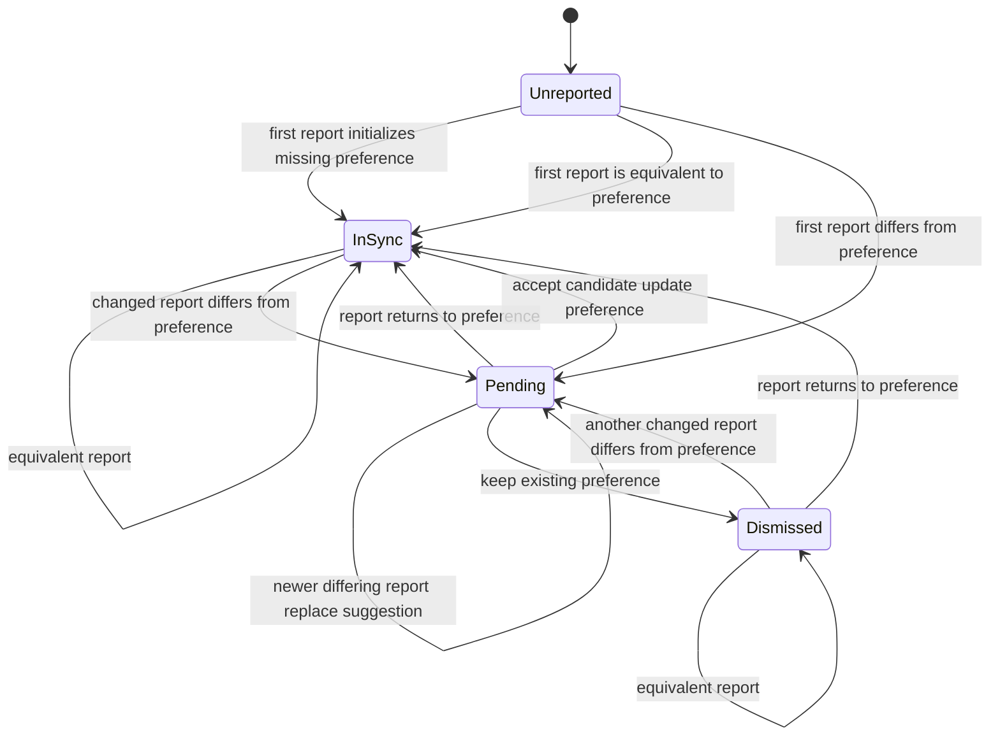

# Regional Settings Observation and Suggestions

Tech Stream Conference website · FastAPI + SvelteKit

## Scope

This document defines how the application stores confirmed regional preferences,
observes the regional settings reported by a browser, and asks an authenticated
user whether changed settings should replace their preferences.

Regional settings consist of:

- an IANA timezone used to display dates and times; and
- a BCP 47 locale used for date and number formatting.

Locale does not control the website's display language. Language selection is a
separate concern and is not part of this design.

The browser reports device settings, not physical location. The application must
therefore use wording such as "This device is now using America/New_York" rather
than claiming that the user moved or changed location.

## Decisions

| Item | Decision |
| --- | --- |
| Confirmed preferences | Store globally on the user. |
| Browser-reported settings | Store on the current application session. |
| Suggestions | Scope them to the current application session. |
| Suggestion decisions | Let the user accept or keep the existing value independently for timezone and locale. |
| Locale meaning | Use it only for date and number formatting. |
| Semantic comparison | Compare timezone aliases and differently cased equivalent locale tags through the existing timezone and language-tag libraries, not as raw strings. |
| Observation history | Store only the latest report; do not retain an append-only history of visits. |
| API indication | Expose one nullable suggestion object from `/auth/me`; do not expose a separate boolean. |

Session scoping prevents two devices from repeatedly overwriting each other's
observations. For example, a laptop in Berlin and a phone in New York retain
separate reported settings and separate pending suggestions while sharing the
same confirmed user preferences.

## Terminology

**Confirmed preferences** are the timezone and locale the user has explicitly
accepted, or the values established by first-use initialization. They apply to
the user across sessions.

**Reported settings** are the latest timezone and locale reported by the browser
for one application session. They describe the device environment and are not
automatically preferences.

**Suggestion** is session-specific pending state that asks whether one or both
reported values should replace the confirmed preferences.

**Equivalent values** may have different spellings but the same meaning. Examples
include IANA timezone aliases and BCP 47 tags that differ only in casing or have
an equivalent canonical form.

## Data model

### Users

The existing nullable `users.timezone` and `users.locale` columns remain the
confirmed preferences. The API continues to expose them together as one nullable
`RegionalSettingsV1` object: either both values are available, or
`regional_settings` is `null`.

The database may temporarily contain only one preference because set-if-unset
initialization is performed per field. The API boundary must continue to hide
such partial state.

### Application sessions

Each `sessions` row stores the latest complete browser report:

```text
reported_timezone     NULLABLE
reported_locale       NULLABLE
reported_at           NULLABLE
```

The two reported values must be null together or non-null together. The timestamp
is null exactly when no report exists. A report with values semantically
equivalent to the stored report is a no-op and must not update `reported_at`.

### Pending suggestions

At most one pending suggestion exists for an application session. A separate row
models it without making the independently actionable fields ambiguous:

```text
regional_settings_suggestions
  id                  UUID PRIMARY KEY
  session_id          FK -> sessions.id, UNIQUE, ON DELETE CASCADE
  timezone            NULLABLE
  locale              NULLABLE
  created_at          NOT NULL
```

At least one of `timezone` and `locale` must be non-null. A null field means that
there is no pending decision for that setting. Once both decisions are resolved,
the suggestion row is deleted.

The UUID identifies the version of the suggestion. Replacing a suggestion after
a newer browser report creates a new UUID, preventing a stale tab from applying
a decision to newer state.

## Semantic comparison

Validation and semantic comparison are separate operations:

1. Validate reported timezones and locales using the existing reusable annotated
   types.
2. Preserve the accepted spelling for storage and API responses.
3. Compare values through focused helpers in the regional-preferences domain
   module:
   - resolve IANA aliases using the timezone database exposed by the existing
     timezone library; and
   - compare the canonical forms produced by the existing BCP 47 library.

Raw string equality must not create suggestions. Timezones must also not be
compared by their current UTC offsets: distinct zones may temporarily share an
offset and later diverge because of daylight-saving or political changes.

## State machine

Timezone and locale each follow this state machine independently. A single API
suggestion may contain the pending state of either or both machines.



`Dismissed` does not require a separate persisted flag. It is represented by a
last reported value that differs from the confirmed preference and has no pending
candidate. Reporting the same equivalent value again therefore does not recreate
the suggestion.

If an explicit manual preference update is made for the current session, any
pending decisions for the affected fields are cleared. The current report is
treated as acknowledged, so the application does not immediately suggest
reverting the manual choice.

A preference changed from another session does not by itself create a suggestion.
Suggestions are triggered by a new report from the current session. This avoids
prompt loops between concurrently used devices.

## Observation processing

The frontend sends one report for each browser document after client-side startup
and after `/auth/me` has confirmed that the browser has an authenticated
application session. It reads the timezone and formatting locale from the browser
and sends them to the dedicated
`PUT /users/me/reported-regional-settings` endpoint.

Consequently, a report is sent after a full page load, when opening the site in a
new tab, or when the frontend establishes a new authenticated session after
login. Client-side navigation within an already running application does not send
another report, and ordinary API requests do not carry these values. A later full
page load reports them again, allowing device-setting changes to be detected. The
backend treats a report equivalent to the session's last report as a no-op.

The backend processes each field independently in one transaction:

1. Lock the current application-session row and load the user's confirmed
   preferences and any pending suggestion.
2. Validate the complete reported pair.
3. For each field whose report is semantically equivalent to the previous report,
   retain its current state.
4. For each changed field:
   - initialize the preference when it is missing;
   - clear its pending candidate when the report is equivalent to the preference;
   - otherwise create or replace its pending candidate.
5. Store the complete latest report and timestamp.
6. Give any materially replaced suggestion a new UUID.
7. Delete an empty suggestion row and commit atomically.

Identical reports are idempotent and perform no database write. Concurrent reports
for the same session are serialized by the database row lock; the last committed
report becomes authoritative for that session.

## API design

All endpoints remain in API v1. The application-session cookie identifies both
the user and the session to which observations and suggestions belong.

### Report the current session's settings

```text
PUT /users/me/reported-regional-settings
```

Request body:

```json
{
  "timezone": "America/New_York",
  "locale": "en-US"
}
```

Both fields are required and use the existing validated semantic types. A
successful report returns `204 No Content`. The frontend then obtains the
authoritative result through `/auth/me`.

### Read the current suggestion

`MeResponseV1` gains one nullable nested object:

```text
regional_settings_change: RegionalSettingsChangeV1 | null
```

Conceptually, the response models are:

```python
class RegionalSettingsChangeV1(BaseModel):
    id: UUID
    timezone: IanaTimezone | None
    locale: Bcp47Locale | None

    @model_validator(mode="after")
    def validate_at_least_one_change(self) -> Self:
        if self.timezone is None and self.locale is None:
            raise ValueError("at least one regional setting must have changed")
        return self


class MeResponseV1(BaseModel):
    # Existing identity fields omitted here.
    regional_settings: RegionalSettingsV1 | None
    regional_settings_change: RegionalSettingsChangeV1 | None
```

At least one field inside `RegionalSettingsChangeV1` is non-null. The model-level
after-validator enforces this invariant whenever the API model is constructed;
it complements the database constraint and the response-construction
precondition instead of relying on either of them. The confirmed value is
available from `regional_settings`; each non-null change field is the new value
reported by the current session.

The nullable object is the change indicator. A separate boolean would duplicate
state and permit contradictory responses such as `has_change = false` alongside
a non-null suggestion.

### Decide pending fields independently

```text
PUT /users/me/regional-settings-changes/{suggestion_id}/decision
```

Request examples:

```json
{
  "timezone": "accept",
  "locale": "keep"
}
```

```json
{
  "timezone": "accept"
}
```

The `timezone` and `locale` members may be omitted independently, but explicit
`null` is not accepted and at least one decision is required. A field may only be
decided when it is non-null in the referenced suggestion.

- `accept` copies that reported value into the user's confirmed preference.
- `keep` leaves the confirmed preference unchanged.
- Either decision removes that field from the pending suggestion.
- Resolving the final field deletes the suggestion.

The update is transactional and returns `204 No Content`. An unknown, superseded,
or current-session-mismatched suggestion ID returns a versioned `409 Conflict`
response. The endpoint must not reveal whether an ID belongs to another session.

Existing explicit preference-update behavior remains available. It clears pending
fields for the current session as described by the state machine.

## Frontend flow

1. After browser-side startup, determine the browser timezone and formatting
   locale.
2. Fetch `/auth/me` to establish whether the application session is
   authenticated.
3. If authenticated, send one report to
   `PUT /users/me/reported-regional-settings`.
4. Refresh `/auth/me` to retrieve any resulting session-specific suggestion.
5. If `regional_settings_change` is non-null, show a prompt for each non-null
   field.
6. Submit the user's independent decisions with the suggestion UUID.
7. Refresh `/auth/me` after the decision.

Recommended timezone wording:

> This device is now using America/New_York. Use that timezone for displayed
> times?

The locale prompt should explicitly mention date and number formatting and must
not imply that accepting it changes the website language.

## Privacy and retention

- Do not infer or store a country or physical location.
- Do not use IP addresses, browser fingerprints, or OIDC data for this feature.
- Do not keep a historical row for each visit.
- Delete reported settings and their suggestion when the application session is
  deleted.
- Do not include raw reported timezone or locale values in logs. If operational
  events are needed, log only opaque identifiers and categorical outcomes.

## Required test coverage

Unit tests must cover:

- first-report initialization, including partial database preference state;
- semantic equivalence for timezone aliases and BCP 47 casing/canonical forms;
- no-op handling for repeated equivalent reports;
- independent timezone and locale suggestions and decisions;
- accepting one field while leaving the other pending;
- declining a candidate without prompting again for the same report;
- replacement of a candidate and UUID after a newer report;
- stale or cross-session decision rejection;
- isolation between two sessions belonging to one user;
- explicit preference updates while a suggestion is pending; and
- concurrent reports for the same session.

Integration tests must cover the migration constraints and the complete
report-to-suggestion-to-decision flow against PostgreSQL.

## Migration and implementation notes

- Add the reported-setting columns and their consistency constraint to
  `sessions`.
- Add the session-scoped suggestion table, its non-empty constraint, unique
  session foreign key, and cascading deletion in the same Alembic migration.
- The authentication dependency currently returns only the account. The new
  session-scoped endpoints and `/auth/me` also need the authenticated application
  session identity. Expose that context without weakening the existing cookie,
  expiry, refresh, or account-validation behavior.
- Keep transition rules in the existing regional-preferences domain module so
  `/auth/me`, observation, explicit updates, and decisions cannot implement
  divergent state rules.
- Regenerate frontend API types from FastAPI's OpenAPI document after the backend
  contract is implemented.
